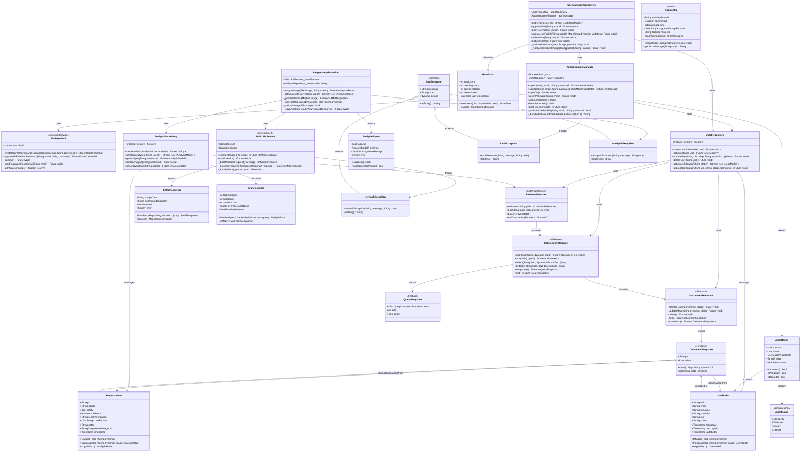

# AnesthesiaSafe - Backend Class Diagram

```mermaid
classDiagram
    %% Firebase Services
    class FirebaseAuth {
        <<External Service>>
        +createUserWithEmailAndPassword(String email, String password) Future~UserCredential~
        +signInWithEmailAndPassword(String email, String password) Future~UserCredential~
        +signOut() Future~void~
        +sendPasswordResetEmail(String email) Future~void~
        +authStateChanges() Stream~User?~
        +currentUser User?
    }

    class FirebaseFirestore {
        <<External Service>>
        +collection(String path) CollectionReference
        +doc(String path) DocumentReference
        +batch() WriteBatch
        +runTransaction(Function) Future~T~
    }

    class CollectionReference {
        <<Firebase>>
        +add(Map~String,dynamic~ data) Future~DocumentReference~
        +doc(String? path) DocumentReference
        +where(String field, dynamic isEqualTo) Query
        +orderBy(String field, bool descending) Query
        +snapshots() Stream~QuerySnapshot~
        +get() Future~QuerySnapshot~
    }

    class DocumentReference {
        <<Firebase>>
        +set(Map~String,dynamic~ data) Future~void~
        +update(Map~String,dynamic~ data) Future~void~
        +delete() Future~void~
        +get() Future~DocumentSnapshot~
        +snapshots() Stream~DocumentSnapshot~
    }

    class DocumentSnapshot {
        <<Firebase>>
        +String id
        +bool exists
        +data() Map~String,dynamic~?
        +get(String field) dynamic
    }

    class QuerySnapshot {
        <<Firebase>>
        +List~QueryDocumentSnapshot~ docs
        +int size
        +bool empty
    }

    %% Data Models (Implicit from Firestore structure)
    class UserModel {
        +String uid
        +String email
        +String fullName
        +String specialty
        +String role
        +String status
        +Timestamp createdAt
        +Timestamp lastLoginAt
        +Timestamp updatedAt
        
        +toMap() Map~String,dynamic~
        +fromMap(Map~String,dynamic~ map) UserModel
        +copyWith(...) UserModel
    }

    class AnalysisModel {
        +String id
        +String userId
        +bool safety
        +double confidence
        +String recommendation
        +List~String~ riskFactors
        +String notes
        +String? segmentedImageUrl
        +Timestamp timestamp
        
        +toMap() Map~String,dynamic~
        +fromMap(Map~String,dynamic~ map) AnalysisModel
        +copyWith(...) AnalysisModel
    }

    %% External API Services
    class SAM2APIService {
        <<External API>>
        +String baseUrl
        +Duration timeout
        
        +segmentImage(File image) Future~SAM2Response~
        +checkHealth() Future~bool~
        -_buildMultipartRequest(File image) MultipartRequest
        -_processResponse(StreamedResponse response) Future~SAM2Response~
        -_handleError(dynamic error) Exception
    }

    class SAM2Response {
        +String imageData
        +String segmentedImageUrl
        +bool success
        +String? error
        
        +fromJson(Map~String,dynamic~ json) SAM2Response
        +toJson() Map~String,dynamic~
    }

    %% Repository Pattern (Implicit in AuthService)
    class UserRepository {
        -FirebaseFirestore _firestore
        
        +createUser(UserModel user) Future~void~
        +getUser(String uid) Future~UserModel?~
        +updateUser(String uid, Map~String,dynamic~ updates) Future~void~
        +deleteUser(String uid) Future~void~
        +getUsersByStatus(String status) Stream~List~UserModel~~
        +updateUserStatus(String uid, String status, String role) Future~void~
    }

    class AnalysisRepository {
        -FirebaseFirestore _firestore
        
        +saveAnalysis(AnalysisModel analysis) Future~String~
        +getUserAnalyses(String userId) Stream~List~AnalysisModel~~
        +getAnalysis(String analysisId) Future~AnalysisModel?~
        +deleteAnalysis(String analysisId) Future~void~
        +getAnalysisStats(String userId) Future~AnalysisStats~
    }

    class AnalysisStats {
        +int totalAnalyses
        +int safeCount
        +int cautionCount
        +double averageConfidence
        +DateTime lastAnalysis
        
        +fromAnalyses(List~AnalysisModel~ analyses) AnalysisStats
        +toMap() Map~String,dynamic~
    }

    %% Authentication & Authorization
    class AuthenticationManager {
        -FirebaseAuth _auth
        -UserRepository _userRepository
        
        +signIn(String email, String password) Future~AuthResult~
        +signUp(String email, String password, UserModel userData) Future~AuthResult~
        +signOut() Future~void~
        +resetPassword(String email) Future~void~
        +getCurrentUser() User?
        +isAuthenticated() bool
        +hasRole(String role) Future~bool~
        -_validateCredentials(String email, String password) bool
        -_handleAuthException(FirebaseAuthException e) String
    }

    class AuthResult {
        +bool success
        +User? user
        +UserModel? userData
        +String? error
        +AuthStatus status
        
        +isSuccess() bool
        +isPending() bool
        +isDenied() bool
    }

    class AuthStatus {
        <<enumeration>>
        SUCCESS
        PENDING
        DENIED
        ERROR
    }

    %% Business Logic Services
    class ImageAnalysisService {
        -SAM2APIService _sam2Service
        -AnalysisRepository _analysisRepository
        
        +analyzeImage(File image, String userId) Future~AnalysisResult~
        +getAnalysisHistory(String userId) Stream~List~AnalysisModel~~
        -_processWithSAM2(File image) Future~SAM2Response~
        -_generateMockCNNAnalysis() Map~String,dynamic~
        -_validateImage(File image) bool
        -_saveAnalysisResult(AnalysisModel analysis) Future~void~
    }

    class AnalysisResult {
        +bool success
        +AnalysisModel? analysis
        +Uint8List? segmentedImage
        +String? error
        
        +isSuccess() bool
        +hasSegmentedImage() bool
    }

    class UserManagementService {
        -UserRepository _userRepository
        -AuthenticationManager _authManager
        
        +getPendingUsers() Stream~List~UserModel~~
        +approveUser(String userId) Future~void~
        +denyUser(String userId) Future~void~
        +updateUserProfile(String userId, Map~String,dynamic~ updates) Future~void~
        +deleteUser(String userId) Future~void~
        +getUserStats() Future~UserStats~
        -_validateUserData(Map~String,dynamic~ data) bool
        -_notifyUserStatusChange(String userId, String status) Future~void~
    }

    class UserStats {
        +int totalUsers
        +int pendingUsers
        +int approvedUsers
        +int deniedUsers
        +DateTime lastRegistration
        
        +fromUsers(List~UserModel~ users) UserStats
        +toMap() Map~String,dynamic~
    }

    %% Configuration & Constants
    class AppConfig {
        <<static>>
        +String sam2ApiBaseUrl
        +Duration apiTimeout
        +int maxImageSize
        +List~String~ supportedImageFormats
        +String firebaseProjectId
        +Map~String,String~ errorMessages
        
        +isValidImageFormat(String extension) bool
        +getErrorMessage(String code) String
    }

    %% Error Handling
    class AppException {
        <<abstract>>
        +String message
        +String code
        +dynamic details
        
        +toString() String
    }

    class AuthException {
        +AuthException(String message, String code)
        +toString() String
    }

    class AnalysisException {
        +AnalysisException(String message, String code)
        +toString() String
    }

    class NetworkException {
        +NetworkException(String message, String code)
        +toString() String
    }

    %% Relationships
    AuthenticationManager --> FirebaseAuth : uses
    AuthenticationManager --> UserRepository : uses
    AuthenticationManager --> AuthResult : returns
    AuthenticationManager --> AuthException : throws

    UserRepository --> FirebaseFirestore : uses
    UserRepository --> UserModel : manages
    UserRepository --> CollectionReference : uses
    UserRepository --> DocumentReference : uses

    AnalysisRepository --> FirebaseFirestore : uses
    AnalysisRepository --> AnalysisModel : manages
    AnalysisRepository --> AnalysisStats : calculates

    ImageAnalysisService --> SAM2APIService : uses
    ImageAnalysisService --> AnalysisRepository : uses
    ImageAnalysisService --> AnalysisResult : returns
    ImageAnalysisService --> AnalysisException : throws

    SAM2APIService --> SAM2Response : returns
    SAM2APIService --> NetworkException : throws

    UserManagementService --> UserRepository : uses
    UserManagementService --> AuthenticationManager : uses
    UserManagementService --> UserStats : calculates

    FirebaseFirestore --> CollectionReference : provides
    CollectionReference --> DocumentReference : contains
    DocumentReference --> DocumentSnapshot : returns
    CollectionReference --> QuerySnapshot : returns

    AuthResult --> AuthStatus : contains
    AuthResult --> UserModel : contains

    AppException <|-- AuthException : extends
    AppException <|-- AnalysisException : extends
    AppException <|-- NetworkException : extends

    %% Data Flow
    UserModel --> DocumentSnapshot : serialized to
    AnalysisModel --> DocumentSnapshot : serialized to
    DocumentSnapshot --> UserModel : deserialized from
    DocumentSnapshot --> AnalysisModel : deserialized from
```