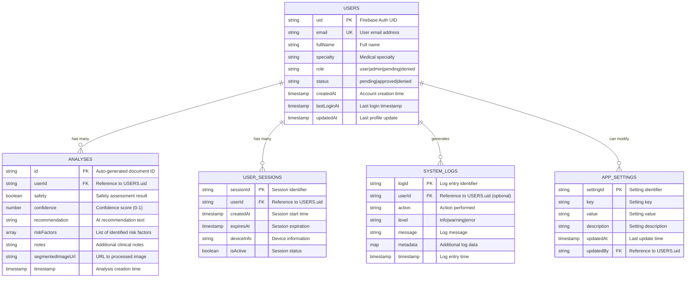

# AnesthesiaSafe - Database Schema (Firestore)



## Firestore Security Rules Structure

```javascript
// Firestore Security Rules (conceptual)
rules_version = '2';
service cloud.firestore {
  match /databases/{database}/documents {
    // Users collection
    match /users/{userId} {
      allow read, write: if request.auth != null && request.auth.uid == userId;
      allow read: if request.auth != null && 
                     get(/databases/$(database)/documents/users/$(request.auth.uid)).data.role == 'admin';
      
      // User's analyses subcollection
      match /analyses/{analysisId} {
        allow read, write: if request.auth != null && request.auth.uid == userId;
        allow read: if request.auth != null && 
                       get(/databases/$(database)/documents/users/$(request.auth.uid)).data.role == 'admin';
      }
      
      // User's sessions subcollection
      match /sessions/{sessionId} {
        allow read, write: if request.auth != null && request.auth.uid == userId;
      }
    }
    
    // System logs (admin only)
    match /systemLogs/{logId} {
      allow read, write: if request.auth != null && 
                            get(/databases/$(database)/documents/users/$(request.auth.uid)).data.role == 'admin';
    }
    
    // App settings (admin only)
    match /appSettings/{settingId} {
      allow read: if request.auth != null;
      allow write: if request.auth != null && 
                      get(/databases/$(database)/documents/users/$(request.auth.uid)).data.role == 'admin';
    }
  }
}
```

## Data Models

### User Document Structure
```json
{
  "uid": "firebase_auth_uid",
  "email": "doctor@hospital.com",
  "fullName": "Dr. John Smith",
  "specialty": "Pediatric Anesthesiologist",
  "role": "user", // user|admin|pending|denied
  "status": "approved", // pending|approved|denied
  "createdAt": "2025-01-XX...",
  "lastLoginAt": "2025-01-XX...",
  "updatedAt": "2025-01-XX..."
}
```

### Analysis Document Structure
```json
{
  "userId": "firebase_auth_uid",
  "safety": true,
  "confidence": 0.92,
  "recommendation": "Patient appears to be in good condition...",
  "riskFactors": ["None detected"],
  "notes": "Patient shows normal facial characteristics...",
  "segmentedImageUrl": "http://server/processed_image.jpg",
  "timestamp": "2025-01-XX..."
}
```

## Indexing Strategy

### Composite Indexes
- `users`: `(status, createdAt)` for admin dashboard
- `analyses`: `(userId, timestamp)` for user history
- `systemLogs`: `(level, timestamp)` for error monitoring

### Single Field Indexes
- `users.email` for login lookups
- `users.role` for role-based queries
- `analyses.safety` for safety statistics
- `analyses.confidence` for confidence analysis