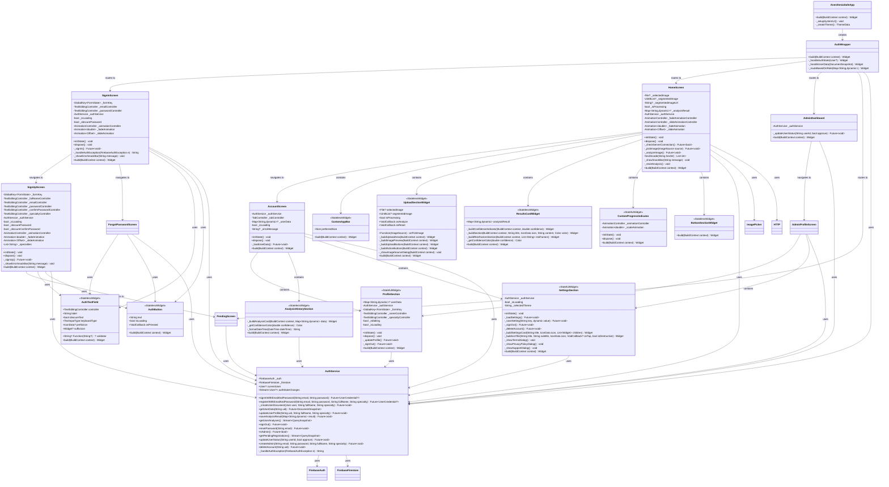

# AnesthesiaSafe - Detailed Frontend Class Diagram

```mermaid
classDiagram
    %% Core Application Classes
    class AnesthesiaSafeApp {
        +build(BuildContext context) Widget
        -_setupSystemUI() void
        -_createTheme() ThemeData
    }

    class AuthWrapper {
        +build(BuildContext context) Widget
        -_handleAuthState(User?) Widget
        -_handleUserData(DocumentSnapshot) Widget
        -_routeBasedOnRole(Map~String,dynamic~) Widget
    }

    %% Screen Classes
    class HomeScreen {
        -File? _selectedImage
        -Uint8List? _segmentedImage
        -String? _segmentedImageUrl
        -bool _isProcessing
        -Map~String,dynamic~? _analysisResult
        -AuthService _authService
        -AnimationController _fadeAnimationController
        -AnimationController _slideAnimationController
        -Animation~double~ _fadeAnimation
        -Animation~Offset~ _slideAnimation
        
        +initState() void
        +dispose() void
        -_checkServerConnection() Future~bool~
        -_pickImage(ImageSource source) Future~void~
        -_analyzeImage() Future~void~
        -hexDecode(String hexStr) List~int~
        -_showSnackBar(String message) void
        -_resetAnalysis() void
        +build(BuildContext context) Widget
    }

    class AccountScreen {
        -AuthService _authService
        -TabController _tabController
        -Map~String,dynamic~? _userData
        -bool _isLoading
        -String? _errorMessage
        
        +initState() void
        +dispose() void
        -_loadUserData() Future~void~
        +build(BuildContext context) Widget
    }

    class SignInScreen {
        -GlobalKey~FormState~ _formKey
        -TextEditingController _emailController
        -TextEditingController _passwordController
        -AuthService _authService
        -bool _isLoading
        -bool _obscurePassword
        -AnimationController _animationController
        -Animation~double~ _fadeAnimation
        -Animation~Offset~ _slideAnimation
        
        +initState() void
        +dispose() void
        -_signIn() Future~void~
        -_handleAuthException(FirebaseAuthException e) String
        -_showErrorSnackBar(String message) void
        +build(BuildContext context) Widget
    }

    class SignUpScreen {
        -GlobalKey~FormState~ _formKey
        -TextEditingController _fullNameController
        -TextEditingController _emailController
        -TextEditingController _passwordController
        -TextEditingController _confirmPasswordController
        -TextEditingController _specialtyController
        -AuthService _authService
        -bool _isLoading
        -bool _obscurePassword
        -bool _obscureConfirmPassword
        -AnimationController _animationController
        -Animation~double~ _fadeAnimation
        -Animation~Offset~ _slideAnimation
        -List~String~ _specialties
        
        +initState() void
        +dispose() void
        -_signUp() Future~void~
        -_showErrorSnackBar(String message) void
        +build(BuildContext context) Widget
    }

    class AdminDashboard {
        -AuthService _authService
        
        -_updateUserStatus(String userId, bool approve) Future~void~
        +build(BuildContext context) Widget
    }

    %% Widget Components
    class CustomAppBar {
        <<StatelessWidget>>
        +Size preferredSize
        +build(BuildContext context) Widget
    }

    class UploadSectionWidget {
        <<StatelessWidget>>
        +File? selectedImage
        +Uint8List? segmentedImage
        +bool isProcessing
        +Function(ImageSource) onPickImage
        +VoidCallback onAnalyze
        +VoidCallback onReset
        
        -_buildUploadArea(BuildContext context) Widget
        -_buildImagePreview(BuildContext context) Widget
        -_buildUploadButtons(BuildContext context) Widget
        -_buildActionButtons(BuildContext context) Widget
        -_showImageSourceDialog(BuildContext context) void
        +build(BuildContext context) Widget
    }

    class ResultsCardWidget {
        <<StatelessWidget>>
        +Map~String,dynamic~ analysisResult
        
        -_buildConfidenceIndicator(BuildContext context, double confidence) Widget
        -_buildSection(BuildContext context, String title, IconData icon, String content, Color color) Widget
        -_buildRiskFactorsSection(BuildContext context, List~String~ riskFactors) Widget
        -_getConfidenceColor(double confidence) Color
        +build(BuildContext context) Widget
    }

    class CustomProgressIndicator {
        <<StatefulWidget>>
        -AnimationController _animationController
        -Animation~double~ _scaleAnimation
        
        +initState() void
        +dispose() void
        +build(BuildContext context) Widget
    }

    class ProfileSection {
        <<StatefulWidget>>
        +Map~String,dynamic~? userData
        -AuthService _authService
        -GlobalKey~FormState~ _formKey
        -TextEditingController _nameController
        -TextEditingController _specialtyController
        -bool _isEditing
        -bool _isLoading
        
        +initState() void
        +dispose() void
        -_updateProfile() Future~void~
        -_signOut() Future~void~
        +build(BuildContext context) Widget
    }

    class AnalysisHistorySection {
        <<StatelessWidget>>
        -_buildAnalysisCard(BuildContext context, Map~String,dynamic~ data) Widget
        -_getConfidenceColor(double confidence) Color
        -_formatDateTime(DateTime dateTime) String
        +build(BuildContext context) Widget
    }

    class SettingsSection {
        <<StatefulWidget>>
        -AuthService _authService
        -bool _isLoading
        -String _selectedTheme
        
        +initState() void
        -_loadSettings() Future~void~
        -_saveSetting(String key, dynamic value) Future~void~
        -_signOut() Future~void~
        -_deleteAccount() Future~void~
        -_buildSettingsCard(String title, IconData icon, List~Widget~ children) Widget
        -_buildListTile(String title, String subtitle, IconData icon, VoidCallback? onTap, bool isDestructive) Widget
        -_showTermsDialog() void
        -_showPrivacyPolicyDialog() void
        -_showSupportDialog() void
        +build(BuildContext context) Widget
    }

    class AuthTextField {
        <<StatelessWidget>>
        +TextEditingController controller
        +String label
        +bool obscureText
        +TextInputType keyboardType
        +IconData? prefixIcon
        +Widget? suffixIcon
        +String? Function(String?)? validator
        
        +build(BuildContext context) Widget
    }

    class AuthButton {
        <<StatelessWidget>>
        +String text
        +bool isLoading
        +VoidCallback onPressed
        
        +build(BuildContext context) Widget
    }

    class BottomSectionWidget {
        <<StatelessWidget>>
        +build(BuildContext context) Widget
    }

    %% Service Classes
    class AuthService {
        -FirebaseAuth _auth
        -FirebaseFirestore _firestore
        
        +User? currentUser
        +Stream~User?~ authStateChanges
        +signInWithEmailAndPassword(String email, String password) Future~UserCredential?~
        +registerWithEmailAndPassword(String email, String password, String fullName, String specialty) Future~UserCredential?~
        -_createUserDocument(User user, String fullName, String specialty) Future~void~
        +getUserData(String uid) Future~DocumentSnapshot~
        +updateUserProfile(String uid, String fullName, String specialty) Future~void~
        +saveAnalysisResult(Map~String,dynamic~ result) Future~void~
        +getUserAnalyses() Stream~QuerySnapshot~
        +signOut() Future~void~
        +resetPassword(String email) Future~void~
        +isAdmin() Future~bool~
        +getPendingRegistrations() Stream~QuerySnapshot~
        +updateUserStatus(String userId, bool approve) Future~void~
        +createAdmin(String email, String password, String fullName, String specialty) Future~void~
        +deleteAccount(String uid) Future~void~
        -_handleAuthException(FirebaseAuthException e) String
    }

    %% Relationships
    AnesthesiaSafeApp --> AuthWrapper : creates
    AuthWrapper --> SignInScreen : routes to
    AuthWrapper --> HomeScreen : routes to
    AuthWrapper --> AdminDashboard : routes to
    AuthWrapper --> PendingScreen : routes to
    AuthWrapper --> AuthService : uses

    HomeScreen --> AccountScreen : navigates to
    HomeScreen --> CustomAppBar : contains
    HomeScreen --> UploadSectionWidget : contains
    HomeScreen --> ResultsCardWidget : contains
    HomeScreen --> CustomProgressIndicator : contains
    HomeScreen --> BottomSectionWidget : contains
    HomeScreen --> AuthService : uses

    AccountScreen --> ProfileSection : contains
    AccountScreen --> AnalysisHistorySection : contains
    AccountScreen --> SettingsSection : contains
    AccountScreen --> AuthService : uses

    SignInScreen --> SignUpScreen : navigates to
    SignInScreen --> ForgotPasswordScreen : navigates to
    SignInScreen --> AuthTextField : uses
    SignInScreen --> AuthButton : uses
    SignInScreen --> AuthService : uses

    SignUpScreen --> PendingScreen : navigates to
    SignUpScreen --> AuthTextField : uses
    SignUpScreen --> AuthButton : uses
    SignUpScreen --> AuthService : uses

    ForgotPasswordScreen --> AuthTextField : uses
    ForgotPasswordScreen --> AuthButton : uses
    ForgotPasswordScreen --> AuthService : uses

    AdminDashboard --> AdminProfileScreen : navigates to
    AdminDashboard --> AuthService : uses

    AdminProfileScreen --> ProfileSection : contains
    AdminProfileScreen --> SettingsSection : contains
    AdminProfileScreen --> AuthService : uses

    ProfileSection --> AuthService : uses
    AnalysisHistorySection --> AuthService : uses
    SettingsSection --> AuthService : uses

    PendingScreen --> AuthService : uses

    %% External Dependencies
    AuthService --> FirebaseAuth : uses
    AuthService --> FirebaseFirestore : uses
    HomeScreen --> ImagePicker : uses
    HomeScreen --> HTTP : uses
```