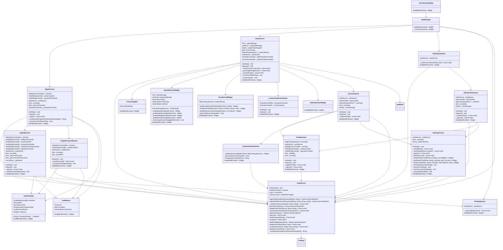

# AnesthesiaSafe - Frontend Class Diagram

```mermaid
classDiagram
    %% Main Application
    class AnesthesiaSafeApp {
        +build(BuildContext) Widget
    }

    %% Authentication Wrapper
    class AuthWrapper {
        +build(BuildContext) Widget
        -_checkUserStatus() Widget
    }

    %% Screens
    class HomeScreen {
        -File? _selectedImage
        -Uint8List? _segmentedImage
        -String? _segmentedImageUrl
        -bool _isProcessing
        -Map~String,dynamic~? _analysisResult
        -AuthService _authService
        -AnimationController _fadeAnimationController
        -AnimationController _slideAnimationController
        +initState() void
        +dispose() void
        -_checkServerConnection() Future~bool~
        -_pickImage(ImageSource) Future~void~
        -_analyzeImage() Future~void~
        -_showSnackBar(String) void
        -_resetAnalysis() void
        +build(BuildContext) Widget
    }

    class AccountScreen {
        -AuthService _authService
        -TabController _tabController
        -Map~String,dynamic~? _userData
        -bool _isLoading
        -String? _errorMessage
        +initState() void
        +dispose() void
        -_loadUserData() Future~void~
        +build(BuildContext) Widget
    }

    class SignInScreen {
        -GlobalKey~FormState~ _formKey
        -TextEditingController _emailController
        -TextEditingController _passwordController
        -AuthService _authService
        -bool _isLoading
        -bool _obscurePassword
        -AnimationController _animationController
        +initState() void
        +dispose() void
        -_signIn() Future~void~
        -_handleAuthException(FirebaseAuthException) String
        -_showErrorSnackBar(String) void
        +build(BuildContext) Widget
    }

    class SignUpScreen {
        -GlobalKey~FormState~ _formKey
        -TextEditingController _fullNameController
        -TextEditingController _emailController
        -TextEditingController _passwordController
        -TextEditingController _confirmPasswordController
        -TextEditingController _specialtyController
        -AuthService _authService
        -bool _isLoading
        -bool _obscurePassword
        -bool _obscureConfirmPassword
        -List~String~ _specialties
        +initState() void
        +dispose() void
        -_signUp() Future~void~
        -_showErrorSnackBar(String) void
        +build(BuildContext) Widget
    }

    class ForgotPasswordScreen {
        -GlobalKey~FormState~ _formKey
        -TextEditingController _emailController
        -AuthService _authService
        -bool _isLoading
        -bool _emailSent
        +dispose() void
        -_resetPassword() Future~void~
        -_showErrorSnackBar(String) void
        +build(BuildContext) Widget
    }

    class PendingScreen {
        -AuthService _authService
        -_signOut(BuildContext) Future~void~
        +build(BuildContext) Widget
    }

    class AdminDashboard {
        -AuthService _authService
        -_updateUserStatus(String, bool) Future~void~
        +build(BuildContext) Widget
    }

    class AdminProfileScreen {
        -AuthService _authService
        -TabController _tabController
        -Map~String,dynamic~? _userData
        -bool _isLoading
        -String? _errorMessage
        +initState() void
        +dispose() void
        -_loadUserData() Future~void~
        -_signOut() Future~void~
        +build(BuildContext) Widget
    }

    %% Services
    class AuthService {
        -FirebaseAuth _auth
        -FirebaseFirestore _firestore
        +User? currentUser
        +Stream~User?~ authStateChanges
        +signInWithEmailAndPassword(String, String) Future~UserCredential?~
        +registerWithEmailAndPassword(String, String, String, String) Future~UserCredential?~
        -_createUserDocument(User, String, String) Future~void~
        +getUserData(String) Future~DocumentSnapshot~
        +updateUserProfile(String, String, String) Future~void~
        +saveAnalysisResult(Map~String,dynamic~) Future~void~
        +getUserAnalyses() Stream~QuerySnapshot~
        +signOut() Future~void~
        +resetPassword(String) Future~void~
        +isAdmin() Future~bool~
        +getPendingRegistrations() Stream~QuerySnapshot~
        +updateUserStatus(String, bool) Future~void~
        +createAdmin(String, String, String, String) Future~void~
        +deleteAccount(String) Future~void~
        -_handleAuthException(FirebaseAuthException) String
    }

    %% Widgets
    class CustomAppBar {
        +Size preferredSize
        +build(BuildContext) Widget
    }

    class UploadSectionWidget {
        +File? selectedImage
        +Uint8List? segmentedImage
        +bool isProcessing
        +Function(ImageSource) onPickImage
        +VoidCallback onAnalyze
        +VoidCallback onReset
        -_buildUploadArea(BuildContext) Widget
        -_buildImagePreview(BuildContext) Widget
        -_buildUploadButtons(BuildContext) Widget
        -_buildActionButtons(BuildContext) Widget
        -_showImageSourceDialog(BuildContext) void
        +build(BuildContext) Widget
    }

    class ResultsCardWidget {
        +Map~String,dynamic~ analysisResult
        -_buildConfidenceIndicator(BuildContext, double) Widget
        -_buildSection(BuildContext, String, IconData, String, Color) Widget
        -_buildRiskFactorsSection(BuildContext, List~String~) Widget
        -_getConfidenceColor(double) Color
        +build(BuildContext) Widget
    }

    class CustomProgressIndicator {
        -AnimationController _animationController
        -Animation~double~ _scaleAnimation
        +initState() void
        +dispose() void
        +build(BuildContext) Widget
    }

    class BottomSectionWidget {
        +build(BuildContext) Widget
    }

    class ProfileSection {
        +Map~String,dynamic~? userData
        -AuthService _authService
        -GlobalKey~FormState~ _formKey
        -TextEditingController _nameController
        -TextEditingController _specialtyController
        -bool _isEditing
        -bool _isLoading
        +initState() void
        +dispose() void
        -_updateProfile() Future~void~
        -_signOut() Future~void~
        +build(BuildContext) Widget
    }

    class AnalysisHistorySection {
        -_buildAnalysisCard(BuildContext, Map~String,dynamic~) Widget
        -_getConfidenceColor(double) Color
        -_formatDateTime(DateTime) String
        +build(BuildContext) Widget
    }

    class SettingsSection {
        -AuthService _authService
        -bool _isLoading
        -String _selectedTheme
        +initState() void
        -_loadSettings() Future~void~
        -_saveSetting(String, dynamic) Future~void~
        -_signOut() Future~void~
        -_deleteAccount() Future~void~
        -_buildSettingsCard(String, IconData, List~Widget~) Widget
        -_buildSwitchTile(String, String, IconData, bool, Function) Widget
        -_buildListTile(String, String, IconData, VoidCallback?, bool) Widget
        -_showDeleteAccountDialog() void
        -_showTermsDialog() void
        -_showPrivacyPolicyDialog() void
        -_showSupportDialog() void
        +build(BuildContext) Widget
    }

    class AuthTextField {
        +TextEditingController controller
        +String label
        +bool obscureText
        +TextInputType keyboardType
        +IconData? prefixIcon
        +Widget? suffixIcon
        +String? Function(String?)? validator
        +build(BuildContext) Widget
    }

    class AuthButton {
        +String text
        +bool isLoading
        +VoidCallback onPressed
        +build(BuildContext) Widget
    }

    %% Relationships
    AnesthesiaSafeApp --> AuthWrapper
    AuthWrapper --> SignInScreen
    AuthWrapper --> HomeScreen
    AuthWrapper --> AdminDashboard
    AuthWrapper --> PendingScreen
    AuthWrapper --> AuthService

    HomeScreen --> AuthService
    HomeScreen --> CustomAppBar
    HomeScreen --> UploadSectionWidget
    HomeScreen --> ResultsCardWidget
    HomeScreen --> CustomProgressIndicator
    HomeScreen --> BottomSectionWidget
    HomeScreen --> AccountScreen

    AccountScreen --> ProfileSection
    AccountScreen --> AnalysisHistorySection
    AccountScreen --> SettingsSection
    AccountScreen --> AuthService

    SignInScreen --> AuthService
    SignInScreen --> SignUpScreen
    SignInScreen --> ForgotPasswordScreen
    SignInScreen --> AuthTextField
    SignInScreen --> AuthButton

    SignUpScreen --> AuthService
    SignUpScreen --> AuthTextField
    SignUpScreen --> AuthButton
    SignUpScreen --> PendingScreen

    ForgotPasswordScreen --> AuthService
    ForgotPasswordScreen --> AuthTextField
    ForgotPasswordScreen --> AuthButton

    AdminDashboard --> AuthService
    AdminDashboard --> AdminProfileScreen

    AdminProfileScreen --> AuthService
    AdminProfileScreen --> ProfileSection
    AdminProfileScreen --> SettingsSection

    ProfileSection --> AuthService
    AnalysisHistorySection --> AuthService
    SettingsSection --> AuthService

    %% External Dependencies
    AuthService --> Firebase
    HomeScreen --> SAM2API
```