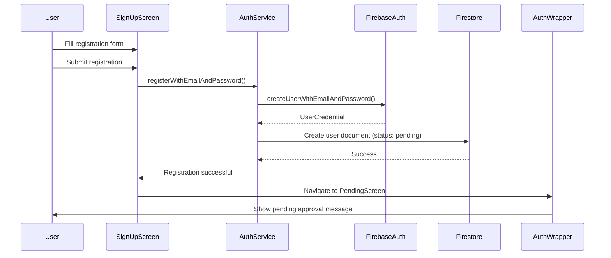
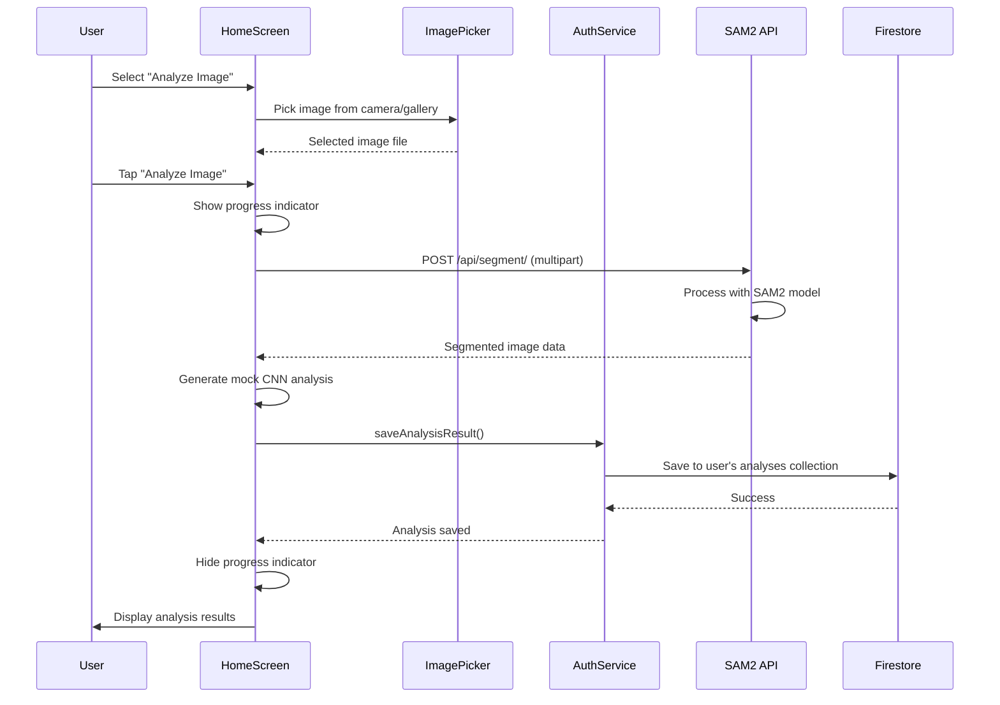
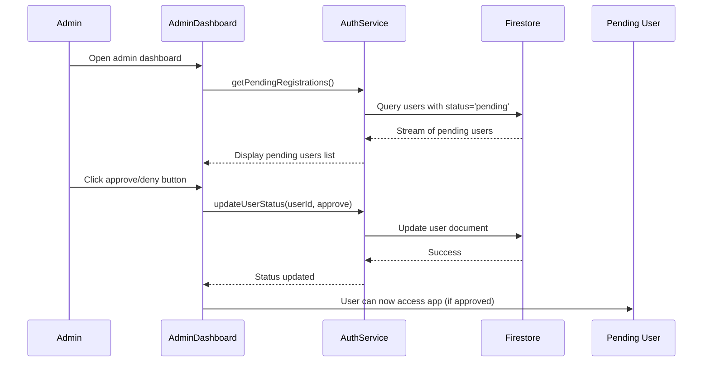
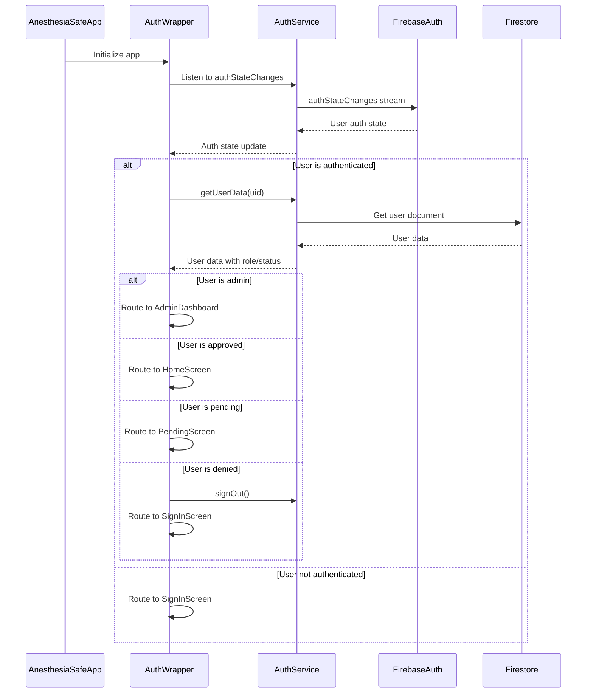
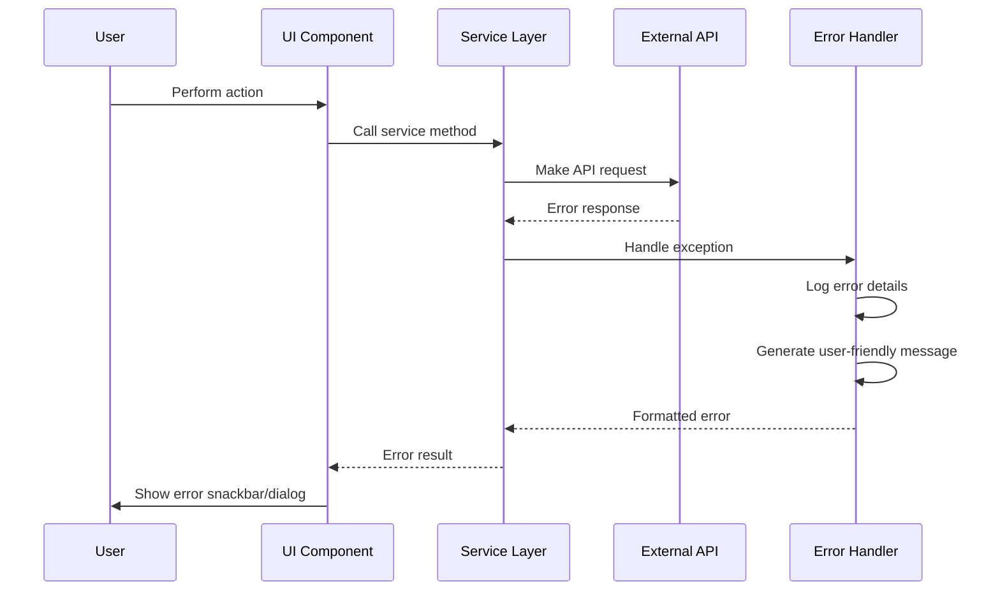

# AnesthesiaSafe - Sequence Diagrams

## 1. User Registration Sequence

## 2. Image Analysis Sequence

## 3. Admin User Approval Sequence

## 4. Authentication State Management Sequence

## 5. Error Handling Sequence

