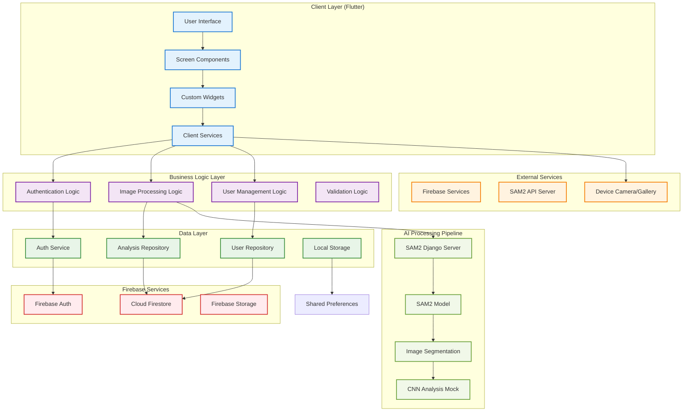

# AnesthesiaSafe - System Architecture Overview

## Architecture Patterns Used

### 1. **Repository Pattern**
- `UserRepository` and `AnalysisRepository` abstract data access
- Provides clean separation between business logic and data persistence
- Enables easy testing and data source switching

### 2. **Service Layer Pattern**
- `AuthService` handles all authentication-related operations
- `ImageAnalysisService` manages image processing workflow
- `UserManagementService` handles user administration

### 3. **Widget Composition**
- Modular widget architecture with reusable components
- Clear separation of concerns between UI and business logic
- Custom widgets for consistent design patterns

### 4. **State Management**
- StatefulWidget for local component state
- StreamBuilder for real-time Firebase data
- FutureBuilder for asynchronous operations

### 5. **Error Handling Strategy**
- Custom exception hierarchy for different error types
- Centralized error handling in service layer
- User-friendly error messages in UI layer

## Data Flow Architecture

1. **Authentication Flow**
   - User input → AuthService → Firebase Auth → User Repository → Firestore
   - Real-time auth state changes propagated through streams

2. **Image Analysis Flow**
   - Image selection → Image validation → SAM2 API → Image segmentation
   - Mock CNN analysis → Results storage → UI display

3. **User Management Flow**
   - Admin actions → UserManagementService → User Repository → Firestore
   - Real-time updates via Firestore streams

## Security Architecture

- **Authentication**: Firebase Auth with email/password
- **Authorization**: Role-based access control (admin/user/pending)
- **Data Security**: Firestore security rules and RLS
- **Input Validation**: Client and server-side validation
- **Error Handling**: Secure error messages without sensitive data exposure