# AnesthesiaSafe - Use Case Diagram

```mermaid
graph TB
    %% Actors
    Doctor[👨‍⚕️ Doctor/Medical Professional]
    Admin[👨‍💼 Admin]
    System[🤖 AI System]
    Firebase[🔥 Firebase]
    SAM2API[🧠 SAM2 API]

    %% Use Cases for Doctor
    subgraph "Doctor Use Cases"
        UC1[Register Account]
        UC2[Sign In]
        UC3[Upload Patient Image]
        UC4[Analyze Image]
        UC5[View Analysis Results]
        UC6[View Analysis History]
        UC7[Update Profile]
        UC8[Reset Password]
        UC9[Sign Out]
        UC10[Delete Account]
    end

    %% Use Cases for Admin
    subgraph "Admin Use Cases"
        UC11[Review Pending Registrations]
        UC12[Approve/Deny Users]
        UC13[Manage User Accounts]
        UC14[View Admin Dashboard]
        UC15[Access Admin Profile]
    end

    %% System Use Cases
    subgraph "System Use Cases"
        UC16[Process Image with SAM2]
        UC17[Generate Safety Assessment]
        UC18[Store Analysis Results]
        UC19[Authenticate Users]
        UC20[Send Notifications]
        UC21[Validate Medical Credentials]
    end

    %% Relationships
    Doctor --> UC1
    Doctor --> UC2
    Doctor --> UC3
    Doctor --> UC4
    Doctor --> UC5
    Doctor --> UC6
    Doctor --> UC7
    Doctor --> UC8
    Doctor --> UC9
    Doctor --> UC10

    Admin --> UC11
    Admin --> UC12
    Admin --> UC13
    Admin --> UC14
    Admin --> UC15
    Admin --> UC2
    Admin --> UC7
    Admin --> UC9

    %% System interactions
    UC4 --> UC16
    UC16 --> SAM2API
    UC4 --> UC17
    UC17 --> System
    UC5 --> UC18
    UC18 --> Firebase
    UC1 --> UC19
    UC2 --> UC19
    UC19 --> Firebase
    UC11 --> UC20
    UC1 --> UC21

    %% Include relationships
    UC3 -.->|includes| UC19
    UC4 -.->|includes| UC19
    UC5 -.->|includes| UC19
    UC6 -.->|includes| UC19
    UC11 -.->|includes| UC19
    UC12 -.->|includes| UC19

    %% Extend relationships
    UC8 -.->|extends| UC2
    UC10 -.->|extends| UC7

    classDef actor fill:#e1f5fe,stroke:#01579b,stroke-width:2px
    classDef usecase fill:#f3e5f5,stroke:#4a148c,stroke-width:2px
    classDef system fill:#e8f5e8,stroke:#1b5e20,stroke-width:2px

    class Doctor,Admin actor
    class UC1,UC2,UC3,UC4,UC5,UC6,UC7,UC8,UC9,UC10,UC11,UC12,UC13,UC14,UC15 usecase
    class UC16,UC17,UC18,UC19,UC20,UC21,System,Firebase,SAM2API system
```

## Use Case Descriptions

### Doctor/Medical Professional Use Cases

1. **Register Account**: Medical professional creates account with credentials
2. **Sign In**: Authenticate with email and password
3. **Upload Patient Image**: Select image from camera or gallery
4. **Analyze Image**: Process image through AI models for safety assessment
5. **View Analysis Results**: Review AI-generated safety recommendations
6. **View Analysis History**: Access previous analysis results
7. **Update Profile**: Modify personal and professional information
8. **Reset Password**: Request password reset via email
9. **Sign Out**: End current session
10. **Delete Account**: Permanently remove account and data

### Admin Use Cases

11. **Review Pending Registrations**: View users awaiting approval
12. **Approve/Deny Users**: Accept or reject user registrations
13. **Manage User Accounts**: Oversee user account status
14. **View Admin Dashboard**: Access administrative interface
15. **Access Admin Profile**: Manage admin account settings

### System Use Cases

16. **Process Image with SAM2**: Use SAM2 model for image segmentation
17. **Generate Safety Assessment**: AI analysis of patient safety
18. **Store Analysis Results**: Save results to database
19. **Authenticate Users**: Verify user credentials
20. **Send Notifications**: Alert users of status changes
21. **Validate Medical Credentials**: Verify professional qualifications